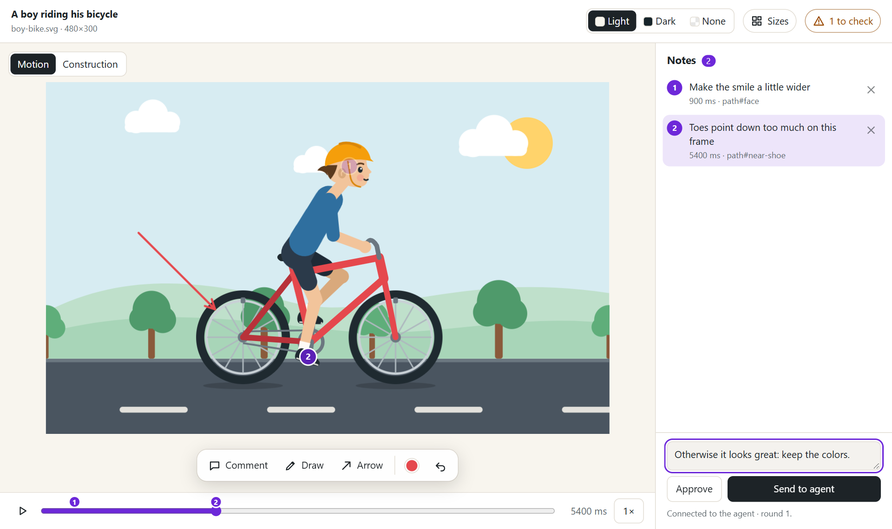
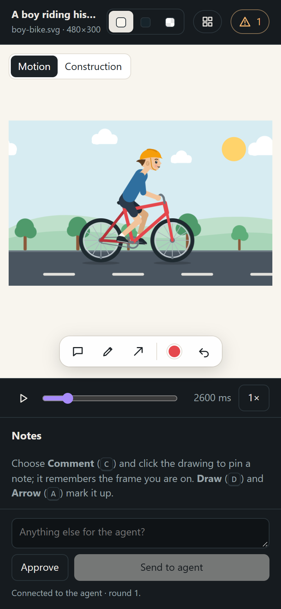
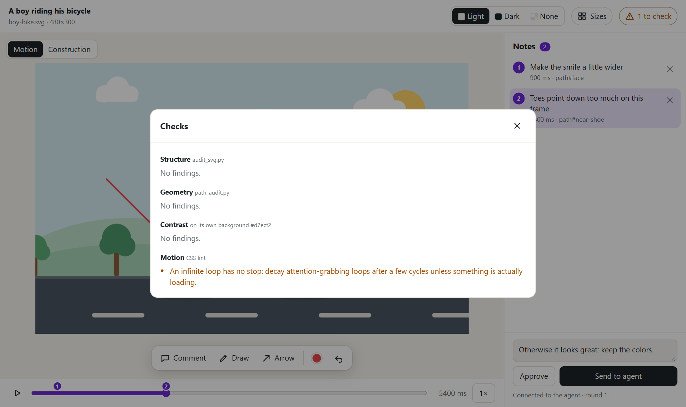

# The review page

Before an agent using this skill hands over a drawing, it opens a review page: you
look at the SVG, point at what is wrong, and send your notes back. The agent gets
exactly what you pointed at — the element, the coordinates, and for animations
the frame time — fixes it, and the page reloads with the new version.



## 1. Open it

**Ask the agent**, for example "show me a preview" or "let me review it". It starts
the review server in the background and gives you a link such as
`http://127.0.0.1:50664/?k=…`. Open it in your browser.

**Or start it yourself** from the skill directory:

```bash
node scripts/review_server.mjs drawing.svg --open
node scripts/review_server.mjs logo.svg --css motion.css --open
```

The server listens on your own machine only (127.0.0.1), and the random `k=` token
in the link keeps other websites from reading or posting to it.

Without a server — an agent without a shell, or a file someone sent you — the
static version works too: `node scripts/preview_html.mjs drawing.svg preview.html`.
Its button reads **Save notes** and downloads your notes as a file (see step 5).

## 2. Look at it

| Control | What it does |
| --- | --- |
| **Light · Dark · None** (top) | Changes the canvas background. A transparent logo must work on all three. |
| **Sizes** | Opens the drawing at its target sizes on transparent, light, and dark backgrounds. |
| **Checks** (`⚠ 1` or `Checks OK`) | Opens the automatic findings: structure, geometry, contrast, and motion. The agent receives these with your notes. |
| **Motion · Construction** | For animated drawings: play the animation, or watch how the drawing is built (strokes first, then fills). A static drawing shows only the construction. |
| **Timeline** | Play or pause (`Space`), drag to any moment, step 40 ms with `←`/`→` (`Shift` for 200 ms). The **1×** button changes the speed. Numbered dots mark where your notes are. |

## 3. Point at what should change

| Tool | Key | How |
| --- | --- | --- |
| **Comment** | `C` | Click the drawing where something is wrong, type your note, press `Enter`. A numbered pin appears. |
| **Draw** | `D` | Drag to draw freely: circle a problem, sketch a shape. |
| **Arrow** | `A` | Drag from where the arrow starts to what it points at. |
| Color dot | | Picks the color for Draw and Arrow. |
| **Undo** | `Ctrl+Z` | `Ctrl+Shift+Z` redoes. |
| | `Esc` | Back to looking (no tool). |

Press a tool again to put it down. In the Notes panel, click a note to select it and
jump to its frame, double-click to edit it, and use **×** to delete it. The box at
the bottom takes an overall note ("keep the colors", "make it friendlier").

**On animations**, pause on the frame that is wrong before you comment; making a
note pauses the animation there if it is still running. Each note keeps its time
(`900 ms`), notes from other moments fade while the timeline is elsewhere, and
clicking a note or its dot on the timeline brings its frame back.

## 4. Send or approve

- **Send to agent** sends everything as one *round*. The agent reads it, changes the
  drawing, and the page reloads by itself with the new version. If you have unsent
  notes when the drawing changes, a banner asks before reloading.
- **Approve** tells the agent the drawing is done. It stops iterating and delivers.

## 5. The offline file

With the static page, **Save notes** downloads `drawing.review.json` and copies it
to the clipboard. Give the file (or paste the text) to the agent; it contains the
same information as a round sent through the server.

## What the agent receives

A short summary it can act on directly —

```text
Note: Otherwise it looks great: keep the colors.
1. at 900 ms (258.64, 71.66) on path#face: Make the smile a little wider
2. at 5400 ms (223.55, 234.33) on path#near-shoe: Toes point down too much on this frame
mark 1 at 5400 ms: arrow around 78.91, 128.61, 65.33, 65.33
Open checks (1):
- Motion: An infinite loop has no stop: …
```

— plus the details in `feedback.json` (each note's element, CSS selector, bounding
box, and colors; your marks; the checks), the drawing with your pins and marks as
SVG and PNG, and **the exact animation frames you commented on**, with your pins
drawn in:


Agents: the loop, the commands, and every field are described in
[review-and-repair.md](../plugins/draw-better-svg/skills/draw-better-svg/references/review-and-repair.md#review-with-the-user).

## On a phone

The page works on narrow screens: the Notes panel moves below the drawing, the
toolbar shows icons only, and tapping works like clicking.



The Checks dialog:



Screenshots are regenerated with `node tools/docs-screenshots.mjs`.
