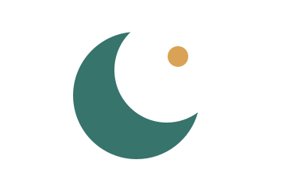
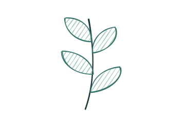
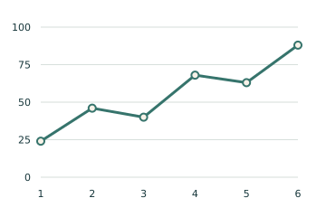
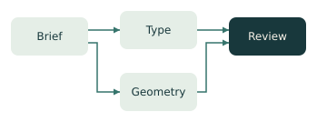
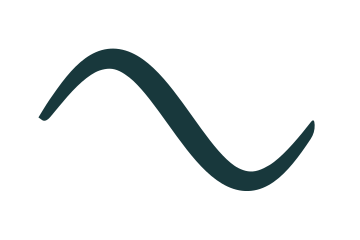
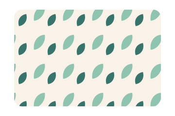

# Examples

Finished work made with the skill, with the evidence behind it. Every SVG here
passes `audit_svg.py` and `path_audit.py`; `npm run check` re-audits them. These
files are not part of the installed skill.

## Case studies

| | |
| --- | --- |
|  | **[A boy riding his bicycle](bicycle-boy/)** — an animated character: IK legs and arm, one 16 s clock, character-motion principles, and four review rounds with the user, each shown next to its fix |
|  | **[Orbit](orbit-logo/)** — a logo reveal: draw-on without a start artifact, overshoot pop, wipe, pixel-exact end state, and a dark-background fix |

## Gallery

The skill's built-in study set, regenerated with
`node plugins/draw-better-svg/skills/draw-better-svg/scripts/generate_examples.mjs examples/gallery`.

| | | | |
| --- | --- | --- | --- |
|  Icon · native primitives |  Mark · Paper.js booleans |  Illustration · SVG.js |  Sketch · Rough.js |
|  Chart · D3 scales |  Diagram · ELK layout |  Ink · Perfect Freehand |  Pattern · tiles |

[`svg-types-atlas.svg`](gallery/svg-types-atlas.svg) puts all eight on one sheet.
