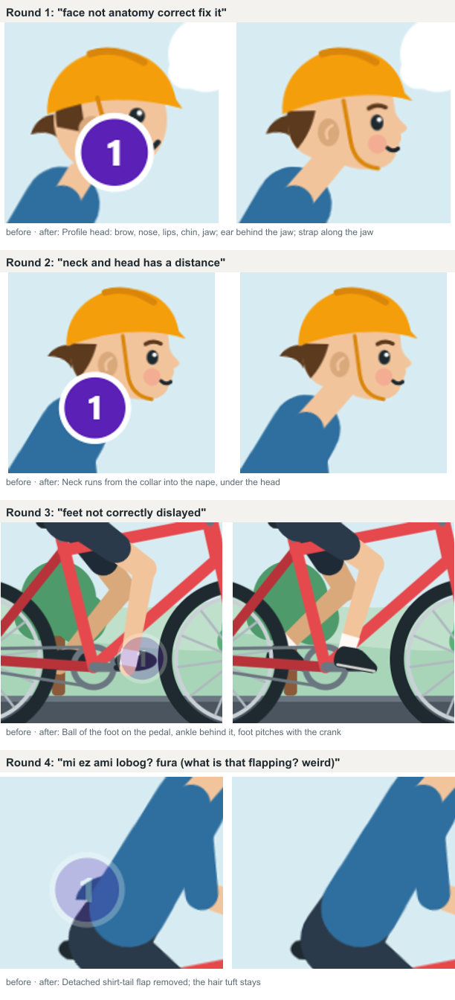

# A boy riding his bicycle


An end-to-end test of the skill: brief, computed geometry, audits, motion QA, and
four review rounds with the user on the interactive review page.

| File | What it is |
| --- | --- |
| [`brief.json`](brief.json) | The planning brief: classification, palette, layers, motion clock, acceptance |
| [`build.mjs`](build.mjs) | The generator (`node build.mjs`); no dependencies |
| [`boy-bike.svg`](boy-bike.svg) | The deliverable: one self-contained SVG, CSS animation inside, 26 KB |
| [`evidence/pedal-cycle.png`](evidence/pedal-cycle.png) | One pedal turn, a frame every 200 ms |
| [`evidence/review-rounds.png`](evidence/review-rounds.png) | Each review comment next to the fix |

## How it is built

- **Computed, not guessed.** Legs are solved by two-bone IK at 24 crank angles; the
  ball of the foot sits on the pedal and the foot pitches with the crank. The arm is
  re-solved for every torso pose so the hand stays on the grip. Measured drift
  between keyframes: feet 0.2 px, hands under 0.01 px.
- **One clock.** Pedal 1600 ms, wheels 800 ms, road markings 400 ms, trees 3200 ms,
  clouds 16000 ms: every period divides the 16 s loop, and the road scrolls at the
  wheels' rolling speed (314 px/s).
- **Character motion** ([motion.md](../../plugins/draw-better-svg/skills/draw-better-svg/references/motion.md#character-motion)):
  the torso rocks and dips on each downstroke with slow in/out, the head follows
  late and counter-rotates, the wind moves a hair tuft.
- **Delivery.** Reduced motion shows the rest pose; the scene is clipped to its
  viewBox so inline embeds do not spill.

## Checks

| Check | Result |
| --- | --- |
| `audit_svg.py` | 0 errors, 0 warnings |
| `path_audit.py` | 0 findings (it caught 3° limb kinks, a shoe with 13–17° kinks, and a face with four near-kinks along the way) |
| First frame vs the static file | 0 visible pixels |
| Reduced motion vs the static file | 0 visible pixels |
| Loop seam, 0 ms vs 16000 ms | 0 pixels |

## Review rounds



| Round | The user's note (frame) | Fix |
| --- | --- | --- |
| 1 | "face not anatomy correct" (8000 ms) | A profile head: brow, button nose, lips, chin, jaw; eye just below the head's middle; ear behind the jaw; the strap along the jaw instead of across the cheek |
| 2 | "neck and head has a distance" (6567 ms) | The neck runs from the collar into the nape, under the head |
| 3 | "feet not correctly displayed" | The ball of the foot on the pedal with the ankle behind it; the foot pitches with the crank; a sneaker over the shin end |
| 4 | "what is that flapping? weird" | A detached shirt-tail flap read as a foreign object and was removed |

Each round also improved the skill: the defect table in
[review-and-repair.md](../../plugins/draw-better-svg/skills/draw-better-svg/references/review-and-repair.md)
gained the face, neck, and foot rows, and the review page's clock now wraps for
looping drawings.

## Rebuild and check

```bash
node examples/bicycle-boy/build.mjs
S=plugins/draw-better-svg/skills/draw-better-svg/scripts
python $S/path_audit.py examples/bicycle-boy/boy-bike.svg
node $S/preview_html.mjs examples/bicycle-boy/boy-bike.svg review/bike-motion.html --mode motion
node $S/capture_frames.mjs review/bike-motion.html review/bike --times 0,400,800,1200,16000
node $S/review_server.mjs examples/bicycle-boy/boy-bike.svg --open
```
