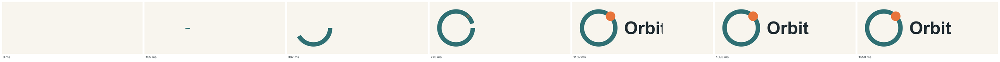

# Orbit: a logo reveal


A small logo animation built by the rules in
[motion.md](../../plugins/draw-better-svg/skills/draw-better-svg/references/motion.md).

| File | What it is |
| --- | --- |
| [`logo.svg`](logo.svg) | The static logo as first drawn; its wordmark vanishes on dark backgrounds (1.08:1) |
| [`logo-themed.svg`](logo-themed.svg) | The fix: a `prefers-color-scheme: dark` rule lightens the wordmark and ring |
| [`motion.css`](motion.css) | The reveal: ring draw-on, dot pop with overshoot, wordmark wipe |
| [`logo-animated.svg`](logo-animated.svg) | `logo-themed.svg` with `motion.css` embedded, for use as an image |
| [`logo-motion.html`](logo-motion.html) | The motion page for frame capture (`?t=`, `?static=1`, `?bare=1`) |
| [`evidence/reveal.png`](evidence/reveal.png) | Frames at 0, 10, 25, 50, 75, 90, and 100 % |



What it demonstrates:

- **Draw-on without a start artifact:** `stroke-dasharray: 1 2` with offset 1 → 0 on a
  `pathLength="1"` ring; `1 1` would leave a sliver at a closed path's seam.
- **Literal keyframe easings:** `var()` inside `@keyframes` is dropped by Chromium.
- **Motion-only properties in keyframes with `backwards` fill:** the last frame is
  exactly the static logo (0 visible pixels), and so is reduced motion.
- **Contrast on both backgrounds:** the review page flagged the original wordmark on
  dark; the themed file passes.

```bash
S=plugins/draw-better-svg/skills/draw-better-svg/scripts
node $S/preview_html.mjs examples/orbit-logo/logo-themed.svg examples/orbit-logo/logo-motion.html --mode motion --css examples/orbit-logo/motion.css
node $S/capture_frames.mjs examples/orbit-logo/logo-motion.html review/orbit --probe "#ring:stroke-dashoffset"
```
